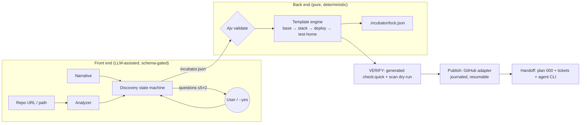
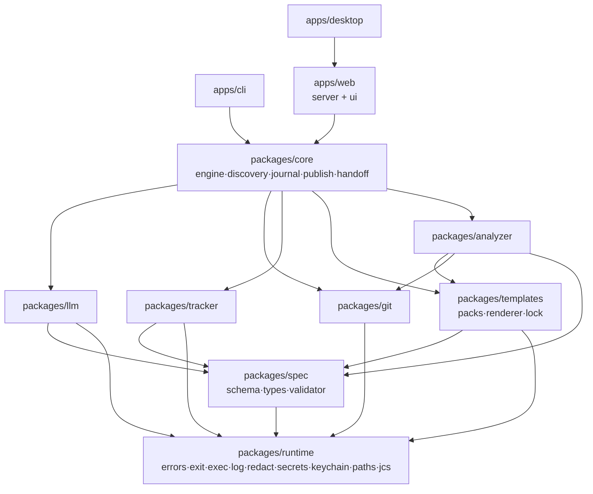
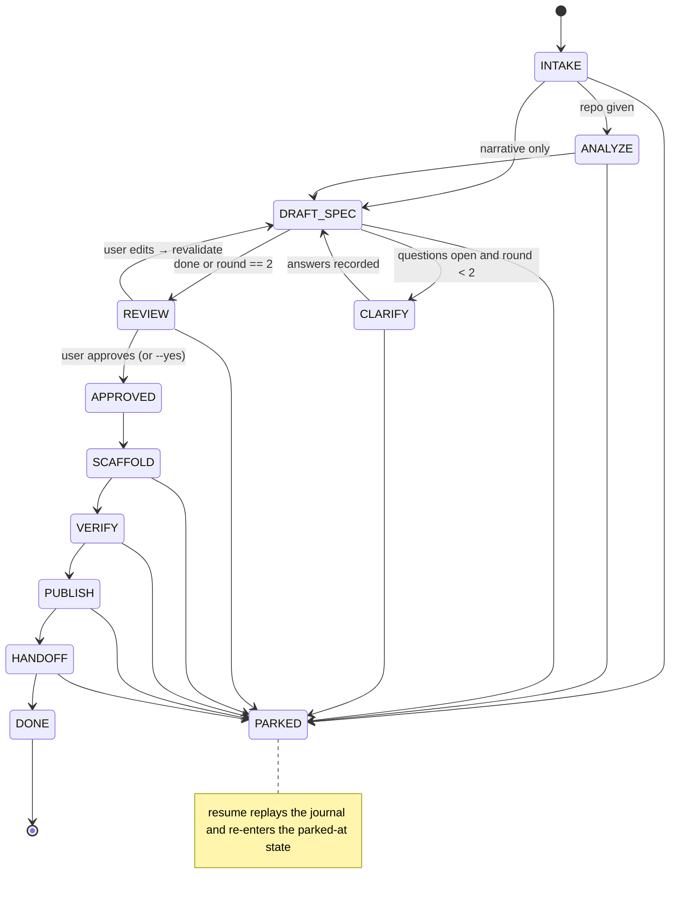
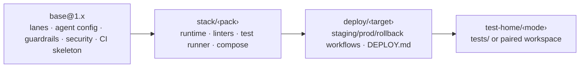
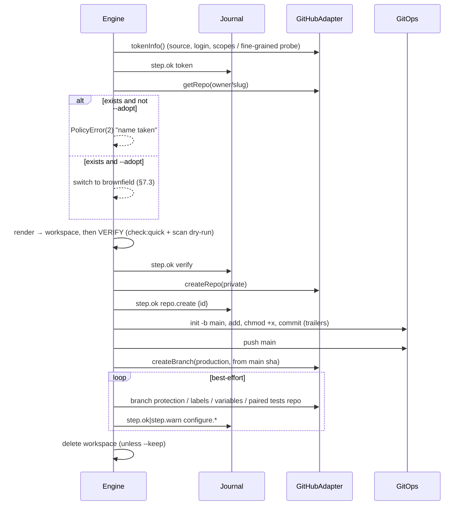
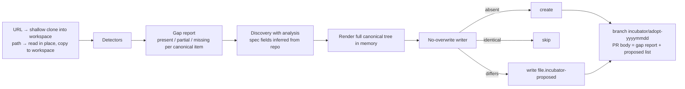
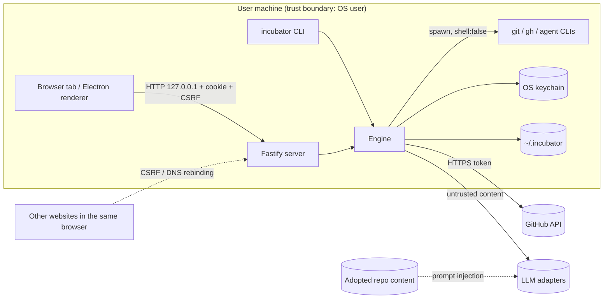

# The Incubator — Technical Design Document

|           |                                                                                                     |
| --------- | --------------------------------------------------------------------------------------------------- |
| Status    | **Draft for approval** (checkpoint 0 of `docs/BUILD_PROMPT.md` §0.1)                                |
| Scope     | Everything in the build brief, §§1–9                                                                |
| Decisions | Recorded as ADRs in [`docs/adr/`](adr/) and indexed in [Appendix A](#appendix-a--adr-index)         |
| Brief     | [`docs/BUILD_PROMPT.md`](BUILD_PROMPT.md). §-references without a document name point to the brief. |

---

## 0. Summary: the architectural strategy

The Incubator is a **deterministic compiler with an LLM front end**. The front end (discovery) turns a
narrative and/or an existing repository into a validated `incubator.json`. The back end (the template
engine) compiles that spec into files. The back end is a pure function:

```
render(spec, packVersions) → { path → bytes }      (no clock, no randomness, no network, no LLM)
```

Everything else is an **effectful shell** around that pure core: publishing to GitHub, seeding a
tracker and handing off to a local AI CLI. Each shell step is journaled, idempotent and resumable.

Five strategic choices shape the design:

1. **One engine, three surfaces.** `packages/core` exposes an `Engine` facade (commands in, `RunEvent`
   stream out). The CLI, the localhost web server and the Electron main process are thin adapters over
   it. Electron runs the same Fastify server in-process on 127.0.0.1, so there is one security model
   and one UI codebase (ADR-012).
2. **Every side effect goes behind an interface with a fake.** The interfaces are `LlmAdapter`,
   `GitHubAdapter`, `GitOps`, `TrackerAdapter`, `Keychain`, `Exec`, `Clock` and `Prompter`. The cloud
   session has no keychain, no logged-in agent CLIs and no GitHub target, so fakes are the default in
   tests. Live implementations are exercised only under `INCUBATOR_LIVE=1` (ADR-015). The fake GitHub
   pushes to a real bare git repository in a temp directory, so git plumbing is always tested for real.
3. **Determinism is enforced, not hoped for.** Eta templates may only read a frozen context
   (ADR-003). A lint rule bans `Date`, `Math.random`, `process`, I/O and imports inside templates.
   Output is normalized to UTF-8 without a BOM and to LF, paths are sorted, and the lockfile records
   per-file SHA-256 hashes (ADR-004). A golden test renders every pack combination twice and compares
   bytes.
4. **Generated repos carry their own guardrails, written once in Node.** Every generated repo gets
   the same zero-dependency `scripts/guard/*.mjs` toolkit, whatever its stack. The toolkit covers the
   BOM guard, isolation lint, completeness score, drift check, policy gate, flake quarantine, plan lint
   and deploy tasks (ADR-013). The Incubator repo runs the _identical_ files, and a drift test proves
   it. That is the dogfood loop (§3 of this doc).
5. **LLM output is untrusted data.** Every LLM response is schema-validated. A failure gets one retry
   with the validation error included, then the run parks. Agent CLIs run with tools disabled, in an
   empty temp directory, with content passed on stdin (ADR-007). Brownfield repository content is
   treated as a prompt-injection vector (§11). LLMs never produce template output.



**What ships when.** Phase 0 builds the skeleton and dogfood guardrails. Phase 1 adds the spec and
discovery. Phase 2 adds templates and scaffolding. Phase 3 adds publish, tracker and handoff. Phase 4
adds brownfield. Phase 5 adds the web UI. Phase 6 adds Electron. Each phase ends with a green
`pnpm check`, acceptance evidence in `docs/phases/phase-N.md`, and a push (§10 of this doc).

**What needs your decision** is collected in [§12 Open questions](#12-risks-and-open-questions). The
two most consequential items are **Q1**, a third deploy class for non-server projects (ADR-016), and
**Q2**, one reference framework per stack pack in v1.

---

## 1. Glossary and cross-cutting conventions

| Term               | Meaning                                                                                                                            |
| ------------------ | ---------------------------------------------------------------------------------------------------------------------------------- |
| **Run**            | One invocation of the pipeline. Its ID is `yyyymmdd-HHMMSS-<6 base32>`. State lives in `~/.incubator/runs/<runId>/`.               |
| **Pack**           | A versioned template directory with `pack.json`: `base`, `stack/<id>`, `deploy/<id>`, `test-home/<id>`.                            |
| **Canonical item** | One requirement of the Backshack Canonical Pattern, declared by a pack. Brownfield detectors check it and the gap report lists it. |
| **Guard toolkit**  | The `scripts/guard/*.mjs` files that every generated repo (and this repo) carries.                                                 |
| **Fake**           | An in-memory or temp-dir implementation of a side-effect interface, used by default in tests.                                      |
| **Live**           | A test or code path that touches real external systems. It runs only with `INCUBATOR_LIVE=1`.                                      |

**Exit-code contract** (`packages/runtime/src/exit.ts`; guard scripts implement the same contract):

| Code  | Meaning                  | Raised by                                                                                     |
| ----- | ------------------------ | --------------------------------------------------------------------------------------------- |
| `0`   | pass                     | normal completion                                                                             |
| `1`   | the tool itself broke    | `ToolError`, any uncaught exception                                                           |
| `2`   | a policy or gate finding | `PolicyError` (gate failed, spec invalid, name taken without `--adopt`, run parked)           |
| `130` | interrupted              | SIGINT or SIGTERM. The handler journals `interrupted`, kills child process trees, then exits. |

A parked run exits `2`, not `1`. Parking is a gate outcome (for example, an LLM response failed the
schema twice), not a crash. A single `main()` wrapper in `apps/cli` maps errors to codes. No other
code calls `process.exit`, and a lint rule enforces that.

---

## 2. Hard constraints (brief §2)

### 2.1 Monorepo and toolchain (ADR-001, ADR-002)

- **pnpm 10 workspaces, Node 22 LTS** (`engines.node: ">=22.12 <23"`, `.nvmrc` = `22`), with
  `packageManager` pinned so Corepack picks the right pnpm.
- **TypeScript 6.0.x, not 7.x.** `typescript-eslint` (8.71) supports `<6.1.0`. TS 7 (the native port)
  is a tracked upgrade (ADR-001). Settings: `strict`, `exactOptionalPropertyTypes`,
  `noUncheckedIndexedAccess`, `verbatimModuleSyntax`, `module: nodenext`.
- **ESM everywhere** (`"type": "module"`). Builds use `tsc -b` project references. Each package
  exports a custom condition `@incubator/source` → `src/*.ts`. Vitest and Vite resolve that
  condition, so tests and dev need no build step. Published entry points are `dist/*.js`.
- **Package boundaries** are enforced by `scripts/guard/deps-boundary.mjs` (§4.1). Cycles fail `check`.
- Beyond the brief's list, there is one extra package, **`packages/runtime`**. It is the kernel shared
  by every adapter: errors and exit codes, `Exec`, logger and redaction, `SecretString`, `Keychain`,
  home-dir paths, canonical JSON and hashing. `core` re-exports the exit codes. Without `runtime`,
  `git` and `llm` would have to depend on `core`, which creates a cycle (ADR-002).

### 2.2 Deterministic scaffolding (ADR-003, ADR-004)

| Rule                                                  | Mechanism                                                                                                                                                                                                                      |
| ----------------------------------------------------- | ------------------------------------------------------------------------------------------------------------------------------------------------------------------------------------------------------------------------------ |
| Same spec + same pack versions ⇒ byte-identical files | `render()` is pure. The context is `deepFreeze({ spec, inputs, derived })`, where `derived` is computed by pure helpers such as slug, PascalCase and port allocation from a hash.                                              |
| No hidden inputs                                      | Template lint rejects `Date`, `Math`, `process`, `globalThis`, `require`, `import(`, `fetch`, `crypto`, `setTimeout`. Only `it.*` and whitelisted `h.*` helpers are allowed.                                                   |
| Stable bytes                                          | Output is UTF-8 without a BOM, CRLF→LF, exactly one trailing LF, and no trailing whitespace except in `*.md` hard breaks. JSON is serialized by one serializer (2-space, key order = schema order for spec, sorted otherwise). |
| Stable ordering                                       | Files are emitted sorted by POSIX path (code-unit order). Marker patches apply in pack-composition order, then by patch ID.                                                                                                    |
| File modes                                            | The manifest declares `mode: "0755"` for executables. Publish sets the bit in the git index (`git update-index --chmod=+x`), because Windows file systems don't carry it.                                                      |
| LLM exclusion                                         | No template helper can reach an adapter. The render context type contains no functions except pure helpers, and a type-level test asserts it.                                                                                  |

LLMs are used only in `DRAFT_SPEC`/`CLARIFY` (discovery), `ANALYZE` (a brownfield _summary_ for the
PR body and REVIEW screen, never files) and `HANDOFF`.

### 2.3 Subprocesses (ADR-008)

All child processes go through `runtime.exec(bin, args, opts)`, which wraps `spawn` with
`shell: false` hard-coded. `opts` has no `shell` field, and a lint rule bans direct `child_process`
imports everywhere except `runtime/src/exec.ts`.

- **Binary resolution** is a custom `which()`. It walks `PATH` and, on Windows, `PATHEXT`, and prefers
  `.exe` over `.cmd`.
- **Windows `.cmd`/`.bat` shims.** Since the CVE-2024-27980 fix, Node rejects them with
  `shell: false` (`EINVAL`). `exec` parses npm-style cmd-shims to recover the target script and spawns
  `process.execPath <script> …args`. If the shim can't be parsed, `exec` fails with a `ToolError` that
  names the shim. It never falls back to a shell.
- **Process trees are killed** with `taskkill /PID n /T /F` on Windows (itself spawned without a shell)
  and with a process group plus `SIGTERM`→`SIGKILL` on POSIX.
- Every call has a timeout, optional stdin, a byte cap on captured output, and a redacting log tee.
- **No absolute machine paths.** Home is resolved with `os.homedir()`, overridable by
  `INCUBATOR_HOME`, which tests always set to a temp directory. `scripts/guard/abs-path-lint.mjs` scans
  tracked files and all generated output for `^[A-Za-z]:\\`, `/home/<x>/`, `/Users/<x>/` and
  `\\\\server\\` patterns (fixing weakness §3.7-1). Every repo gets `.gitattributes` with
  `* text=auto eol=lf` plus binary overrides.

### 2.4 Secrets (ADR-009)

**GitHub token resolution order** (first hit wins; `doctor` reports which source is used, never the
value):

1. the OS keychain via `@napi-rs/keyring` (service `incubator`, account `github`). This is a Node-API
   module, so it is ABI-stable and loads in Electron without a rebuild;
2. `gh auth token` (spawned through `exec`);
3. the `GITHUB_TOKEN` environment variable.

`incubator auth set` stores a token in the keychain. There is **no plain-text fallback**: if no
keychain exists (for example, headless Linux without Secret Service), the token source must be `gh` or
the environment variable, and `doctor` says so.

**`SecretString`** wraps every secret. `toString()`, `toJSON()` and `util.inspect` return
`[REDACTED]`, and `.reveal()` is called only at the HTTP or git boundary. Every revealed value is
registered with the global **Redactor**, which sits at the logger sink and on the `exec` output tee.
The Redactor replaces:

- exact matches, plus their URL-encoded and Base64 (`x-access-token:<t>`) forms;
- token-shaped patterns: `ghp_`, `gho_`, `ghu_`, `ghs_`, `github_pat_`, `sk-ant-`, and
  `Authorization: \S+ \S+`.

**Git authentication never puts the token in a URL or argv.** `exec` passes it through environment
config (`GIT_CONFIG_COUNT=1`, `GIT_CONFIG_KEY_0=http.https://github.com/.extraheader`,
`GIT_CONFIG_VALUE_0=AUTHORIZATION: basic <b64>`). It therefore never lands in `.git/config`, `ps`
output or the journal. A test greps every file under the run directory, plus captured stdout and
stderr, for the fake token and its encodings (Phase 3 acceptance).

### 2.5 Local state

```
~/.incubator/                 (or $INCUBATOR_HOME)
  config.json                 schema-validated; adapters, model, defaults, gc.days (default 14)
  runs/<runId>/
    run.json                  immutable header: inputs, versions, surface
    journal.jsonl             append-only event log (ADR-010)
    spec/incubator.json       current draft; spec/history/NNN.json per revision
    workspace/                rendered repo (and <name>-tests/ for paired-repo)
    logs/incubator.log        JSONL, redacted
    logs/handoff.log          agent CLI stream, redacted
  cache/packs/<id>@<ver>/     reserved for remote packs; bundled packs load from packages/templates
```

- **Workspace lifecycle.** A successful publish deletes `workspace/`. The journal, logs and spec stay
  until `gc`. On failure, or with `--keep`, the workspace is kept.
- **`incubator gc [--days N] [--dry-run]`** removes runs whose last journal entry is older than N days
  and that are not parked. Add `--include-parked` to remove those too.
- The config file and run directories are created with mode `0700` on POSIX and inherit the user
  profile's ACL on Windows.

### 2.6 Exit codes

See §1. Every generated script (`scripts/guard/*.mjs`, `scripts/run-deploy-tasks.mjs`) implements the
same contract. So does every generated `package.json`/`composer.json`/`pyproject` task wrapper. The
base pack has a contract test for it.

---

## 3. The Backshack Canonical Pattern as template packs (brief §3)

Each subsection of brief §3 maps to one or more packs. Every item in the table is a **canonical
item** with a stable ID; packs declare them and brownfield detectors check them.

| Brief §          | Canonical items (IDs abbreviated)                                                                                                                                                                        | Pack                             | Dogfooded in this repo (phase)                        |
| ---------------- | -------------------------------------------------------------------------------------------------------------------------------------------------------------------------------------------------------- | -------------------------------- | ----------------------------------------------------- |
| 3.1 lanes        | `env.compose`, `env.bootstrap-db`, `wf.deploy-staging`, `wf.validate-staging`, `wf.promote`, `wf.deploy-prod`, `wf.rollback`, `deploy.tasks`, `doc.deploy`                                               | `deploy/*` + `stack/*` (compose) | promote/rollback shape via `package-release` (P6, Q1) |
| 3.2 work lanes   | `lanes.<9>.{enrich,codegen,preflight}`, `agent.profile`, `plans.dir`, `plans.000`, `tracker.config`                                                                                                      | `base`                           | P0 (lanes, profile, plans)                            |
| 3.3 tests        | `test.home`, `test.scenarios`, `test.profiles`, `test.quarantine`, `test.suites`, `ci.gate`                                                                                                              | `test-home/*` + `stack/*`        | P0 (profiles, quarantine, gate); scenarios from P1    |
| 3.4 security     | `sec.scan-wf`, `sec.rules+fixtures`, `sec.policy-gate`, `sec.accepted-risks`, `guard.bom`, `guard.syntax`, `guard.lint`, `guard.hooks`, `guard.audit`, `guard.isolation`, `contracts.pin`, `env.example` | `base` + `stack/*` (linters)     | P0                                                    |
| 3.5 scaffolder   | `scaffold.markers`, `scaffold.todo-score`, `guard.drift`                                                                                                                                                 | `base`                           | P0 (score, drift)                                     |
| 3.6 agent config | `agent.claude-md`, `agent.agents-md`, `agent.copilot`, `agent.cursor`, `agent.settings-hooks`                                                                                                            | `base`                           | P0                                                    |

### 3.1 Environment lanes

- **local.** `compose.yaml` runs the app plus the DB: Postgres 17 for `node-web`/`python-service` and
  MariaDB 11 for `wordpress`. `node-lib` has no compose. `scripts/db/bootstrap.mjs` starts from an
  empty DB and applies `db/schema/base.sql`, then `db/migrations/NNNN_*.sql` in numeric order, then
  `db/seed/*.sql`. It records applied migrations in `_migrations`. Re-running it is a no-op, and
  `--reset` drops and rebuilds. WordPress uses WP-CLI inside compose for install, then the same
  migration runner against the plugin's tables.
- **staging.** `deploy-staging.yml` runs on `push: main`, then calls `validate-staging.yml`
  (`workflow_call`) for smoke checks. `.env.staging.example` sets `APP_ENV=staging`, and every
  downstream integration key is a dummy (`DUMMY_*`). App bootstrap asserts that when
  `APP_ENV=staging`, no key matches the production allowlist pattern, and refuses to start if one
  does. On `vps-tailscale`, the staging vhost binds only to the tailnet interface and CI reaches it
  through `tailscale/github-action` (SHA-pinned).
- **prod.**
  1. `promote-to-production.yml` is `workflow_dispatch` only, with `execute_tasks` defaulting to
     `false` (dry run: it prints the merge plan and the deploy-tasks plan).
  2. It merges `main` into `production` with `--no-ff` and the trailer `Promote-Run: <run id>`.
  3. It dispatches `deploy-production.yml`, which has **no push trigger**, via
     `gh workflow run --ref production`. (This is the one place the generated CI uses `gh`. It runs on
     the Actions runner with `GITHUB_TOKEN` and `actions: write`, scoped to that job only.)
  4. `rollback-production.yml` verifies that the target SHA is the most recent commit carrying a
     `Promote-Run:` trailer on `production`. It then repoints (VPS: swap the symlink to the previous
     release directory; docker: redeploy the previous image digest) or reverts, and smoke-tests.
- **Post-deploy tasks.** `.deploy-tasks.json` is validated by
  `schemas/deploy-tasks.schema.json`. Each entry has `name`, `env[]`, `idempotent`, `runOnce` and
  `timeout`.
  - `scripts/run-deploy-tasks.mjs --env <e> --sha <s> [--log <path>] [--yes]` defaults to a dry run
    and runs only with `--yes`.
  - It appends one JSONL line per task to `deploy-tasks.log.jsonl`, keyed by `(name, env, sha)`, and
    skips `runOnce` tasks already recorded for that key.
  - `--report` prints the staging-vs-prod gap matrix, meaning tasks run on staging at a SHA but not
    yet on prod.
- **`deploy/vps-tailscale`.**
  - Releases go to `releases/<UTC yyyymmddHHMMSS>-<sha7>/`. The timestamp comes from the workflow at
    deploy time, not from the scaffold, so determinism holds.
  - An atomic swap does `ln -sfn` to `current.tmp`, then `mv -T`.
  - The last 5 releases are kept.
  - The process manager is PM2 (Node) or compose (Python/WP).
  - Jobs run on a self-hosted runner with the label `incubator-<slug>`.
- **`deploy/docker-host`.** Build, then push to GHCR (the image digest is recorded). Then SSH (the key
  comes from a secret; `StrictHostKeyChecking` uses a pinned `known_hosts` secret) and run
  `docker compose pull && docker compose up -d --wait`. Health-check gating uses the compose
  `healthcheck` plus a post-deploy HTTP probe.
  - `scripts/deploy/docker-remote.mjs` does this without a remote shell: `ssh`/`scp` get argv arrays
    and every remote argument must match `[A-Za-z0-9@%+=:,./_-]+`, so workflow inputs can never be
    read as shell syntax on the host. Each deploy appends `{sha, image, at}` to `releases.log` on the
    host (through `tee -a`); rollback redeploys the latest earlier digest that was never rolled back.
  - Post-deploy tasks run inside the app container (`docker compose exec -T app …`), and the task log
    lives on the host so `runOnce` holds across ephemeral runners.
- **`deploy/package-release`** (ADR-016). Staging builds the exact tarball a release would publish,
  installs it into an empty project, imports it, runs every `bin --version`, and uploads it with
  `SHA256SUMS`; nothing is published. Prod (dispatch-only, like the other classes) runs `check full`,
  refuses an already-published version, smoke-tests the tarball, publishes _that_ tarball (with npm
  provenance for public packages) and creates the GitHub release. Rollback moves the `latest`
  dist-tag; published versions are never unpublished.
- **Workflow hygiene** is enforced by `scripts/guard/workflow-lint.mjs` plus actionlint:
  - every `uses:` must match `@[0-9a-f]{40}` followed by a `# vX.Y.Z` comment. SHAs come from
    `packages/templates/actions-lock.json`, which `pnpm actions:refresh` updates;
  - each workflow has top-level `permissions: contents: read`, and jobs widen explicitly;
  - every step with `run:` longer than one line, or any `if:`, needs a preceding `# why:` comment;
  - `DEPLOY.md` states the deploy class and the promotion rules, rendered from the spec.

### 3.2 Work-type lanes and the autonomous dev loop

- **Lane templates.** Each of the nine lanes gets `.incubator/lanes/<lane>/{enrich,codegen}.md`
  (required) and `preflight.md` (optional; shipped for `security`, `infra` and `support/existing`).
  - The lane directory name is the lane ID with `/` turned into a nested directory:
    `.incubator/lanes/enhancement/new/`.
  - **Enrich output contract** (enforced by `guard/lane-contract.mjs`, run on every template in `check`):
    - the template must instruct the model to emit exactly one `VERDICT:` line from
      `{REAL_FIX, NOT_A_BUG, DUPLICATE, NEEDS_INFO, OUT_OF_SCOPE}`;
    - the template must instruct numbered `**Step N:**` blocks, each with at least one `- Target:`
      line;
    - the template must contain a worked example that itself passes the contract parser. The same
      parser validates real enrich outputs at runtime.
- **Ticket state machine.** A pure `transition(state, event)` in `packages/tracker` covers
  `NEW → TAGGED_TO_RELEASE → ENRICHMENT_IN_PROGRESS → DEV_IN_PROGRESS → READY_FOR_TEST →
TEST_PASSED | TEST_FAILED → DEPLOYED`. `TEST_FAILED → DEV_IN_PROGRESS` is the only backward edge.
  An illegal transition is a `PolicyError`.
- **Runner stages** are
  `selected → repo_resolved → design → preflight → enrich → verify_baseline → codegen → verify →
qa_gate → ready_for_test`. `design` runs only for `enhancement/*` lanes.
  - The generated repo ships this as documentation plus a `runner` section in the agent profile. The
    Incubator's own handoff (§8) runs `enrich → codegen → verify → qa_gate` for plan 000.
  - A failing gate **parks**: it records `{stage, gate, evidence}` and stops, with no retry.
  - Any human nudge, meaning a manual edit or re-run while parked, must be recorded with
    `incubator nudge <runId> --note` (or the local-tracker equivalent) as a remediation item. The next
    stage refuses to start while an unrecorded nudge is detected (the workspace changed since park and
    no nudge entry exists).
- **Agent profile.** `.incubator/agent-profile.json` is validated by
  `schemas/agent-profile.schema.json` and pinned (§3.4). It contains:
  - `actions[]` (`{id, kind: read|generate|save|gate, command?}`);
  - `denied_actions[]` (defaults include force-push, history rewrite, test deletion, disabling a gate,
    editing `config/flake-quarantine.json` without an owner and expiry, and touching `.incubator/lock.json`);
  - `human_only_actions[]` (defaults include promote to production, rollback, rotating secrets, and
    changing the accepted-risk register);
  - `run_ceilings`, taken from `spec.agents.runCeilings`. A value of `0` means "use the pack
    default": 60 turns, 400 tool calls, 45 minutes, USD 10.
- **Executor-plan format.** Plans live in `docs/plans/NNN-<slug>.md`. `guard/plan-lint.mjs` checks for
  the five required sections by heading: `## Executor preamble`, `## Touched files and markers`
  (table), `## Acceptance commands` (fenced command plus fenced expected output),
  `## Drift and hallucination guardrails` (table: Trap | Why | Mechanical check) and
  `## Review rounds` (table with a `FIX-FIRST|CLOSED` status column). It also fails if any
  `plan*.md` exists at the repo root (fixing weakness §3.7-4).
- **Tracker adapter.** `TrackerAdapter { createTicket, getTicket, transition, addRemediation,
fileCiFailure }`, implemented by `leantime`, `local` and `fake`. See §4.4 and ADR-017. CI failure
  triage runs in a separate `if: failure()` step with `continue-on-error: true`, **after** the gate
  step has already set the job result. The step cannot change the verdict, and a workflow-lint rule
  checks that shape.

### 3.3 Test pipeline

- **Test home.**
  - `in-repo` puts everything under `tests/`.
  - `paired-repo` renders a second workspace, `<slug>-tests`. The app's `test` script prints
    `Tests live in <owner>/<slug>-tests — see TESTING.md` and exits `1`. The tests repo's CI checks
    out the app with `actions/checkout` (`repository:` plus the `APP_REPO_READ_TOKEN` secret, listed
    by name only) into `app/`.
- **Scenario contract layer.**
  - `schemas/scenario.schema.json` (pinned) defines `seed`, `context`, `mocks.ai` and
    `stages[].assertions[{path, op, value}]`. The `op` values are `eq`, `neq`, `contains`, `matches`,
    `exists`, `absent`, `gte`, `lte` and `length`.
  - Each feature has an adapter implementing `name`, `seedContext`, `runStage`, `captureOutput` and
    `validate`. It is a TS interface (Node), a PHP interface or a Python Protocol, with one shared
    JSON contract.
  - Every stack pack ships a **working `health` feature** with the onboarding minimum: 1 happy path,
    2 validation failures and 1 fault injection. That means every profile has scenarios from the
    first commit and zero-scenario profiles can't happen (fixing weakness §3.7-5).
  - Each feature in `intent.coreFeatures` gets the same four scenario stubs marked `TODO(scaffold)`.
- **Run profiles.** `config/run-profiles.json` defines `quick`, `full`, `chaos`, `hardening`,
  `release` and `live` as `{suites[], scenarioTags[], env, requiresLive}`. `test:profile <name>` runs
  one. `guard/profiles.mjs` fails any profile that resolves to zero scenarios.
- **Suites.**
  - `unit`: an isolation harness rejects sockets, DB drivers and sibling-repo paths. Vitest uses a
    setup file that stubs `net.connect`; pytest uses a `conftest` socket block; PHPUnit uses a
    bootstrap guard.
  - `integration/db`: a compose service in CI.
  - `e2e`: Playwright with projects `local`, `staging` and `production-smoke`. Only `node-web` and
    `python-service` ship e2e (the latter via Playwright for Python); WordPress ships e2e against
    wp-env.
  - Runners per stack pack: `node-web`/`node-lib` use **Vitest**, `wordpress` uses **PHPUnit 11**
    (plus Brain Monkey for unit), and `python-service` uses **pytest**.
- **Guardrails** (every one fails closed with exit `2`):

  | Guard                                  | Implementation                                                                                                                                                                                 |
  | -------------------------------------- | ---------------------------------------------------------------------------------------------------------------------------------------------------------------------------------------------- |
  | Zero tests collected                   | Parses the runner's JSON/JUnit report and fails if `tests == 0` for any enabled suite.                                                                                                         |
  | Happy-path coverage and catalog parity | `config/features.json` (catalog) ↔ scenario files. Every feature needs ≥1 `happy`, ≥2 `validation` and ≥1 `fault` scenario tag.                                                                |
  | Completeness score                     | `guard/completeness.mjs`, 0–100, must be ≥ `testing.completenessThreshold` (default 70). ADR-018.                                                                                              |
  | Drift checker                          | Registries (`config/features.json`, `.incubator/lanes/**`, routes or CLI commands declared in `scaffold` markers) ↔ code. Each registry entry must resolve to a file or symbol and vice versa. |
  | Flake quarantine                       | `config/flake-quarantine.json` entries `{testId, owner, expires, reason, issue}`. An expired or ownerless entry fails. Quarantined tests still run, and the report lists them.                 |
  | Warnings and risky tests               | Vitest `--reporter=json` plus `onConsoleLog` fail; PHPUnit `failOnWarning`/`failOnRisky`; pytest `-W error`.                                                                                   |
  | Coverage threshold                     | `testing.coverageThreshold` (default 80), wired into v8/Xdebug/coverage.py configs.                                                                                                            |

- **CI shape.** Each suite job uses `if: always()` after setup, so every suite reports. A final
  `gate` job has `needs: [all]` and `if: always()`, and fails explicitly unless every `needs.*.result`
  is `success`. The Incubator's own `ci.yml` uses the same shape.

### 3.4 Security and guardrails

- **`security-scan.yml`** (ADR-014):
  - Semgrep runs from hash-locked wheels with `--config p/default` (`auto` forces metrics on) plus
    `security/rules/`.
  - Trivy fs scan at HIGH/CRITICAL, via the SHA-pinned action.
  - gitleaks runs as a **binary download with a pinned SHA-256**, not `gitleaks-action`, because the
    action requires a paid licence for organisation repos.
  - All three emit SARIF/JSON into `scan-results/`. Then:
    - `guard/validate-scan-results.mjs` checks the shape of each file with pinned schemas and fails
      with `1` on a malformed or missing report;
    - `guard/policy-gate.mjs` computes the fingerprints, applies the register, and exits `2` on any
      finding ≥ `security.policyGate`.
- **Stable fingerprints.** `sha256(tool ‖ ruleId ‖ repoRelPath ‖ normalizedSnippet)`, where the
  snippet has its whitespace collapsed and line numbers excluded, so the ID survives line shifts.
  Findings that carry their own stable ID (gitleaks `Fingerprint`, Trivy `VulnerabilityID+PkgName`)
  use that ID instead.
- **Accepted-risk register.** `security/accepted-risks.json` entries are
  `{fingerprint, ruleId, reason, owner, expires}`. Each entry is required for a suppression. Inline
  `nosemgrep`/`gitleaks:allow` without a matching register entry is itself a finding. An expired entry
  reactivates the finding.
- **Local rules with fixtures.** `security/rules/<id>.yml` goes with
  `security/fixtures/<id>/{bad,good}.*`. `guard/rule-fixtures.mjs` runs Semgrep on the fixtures and
  asserts that every rule fires on `bad` and stays silent on `good`. This runs in `security-scan.yml`
  and in `check` when semgrep is on PATH (the tools fetch installs it, ADR-019).
- **Central rig.** When `security.centralRig.enabled`, the pack adds `security-scan-trigger.yml`,
  which sends a `repository_dispatch` to `centralRig.repo` with `{repo, sha, ref}`. The token secret
  is listed by name only.
- **Always on:**
  - `guard/bom.mjs`;
  - `guard/syntax.mjs` (`node --check` / `php -l` / `python -m py_compile`, each over tracked files);
  - ESLint + Prettier, PHP-CS-Fixer + PHPStan (level 6), or Ruff (lint + format);
  - lefthook (`pre-commit`: BOM, format, lint-staged, abs-path; `pre-push`: `check:quick`);
  - `npm audit --audit-level=high`, `composer audit` or `pip-audit`.
- **Isolation lint.** `guard/isolation.mjs` resolves every relative import, `require`,
  `require_once`/`include` and Python `sys.path` mutation, and fails if the resolved path leaves the
  repo root. It `lstat`s every tracked path and fails on symlinks whose `realpath` escapes. It also
  fails on CLAUDE.md/AGENTS.md links that point outside the repo (fixing weakness §3.7-6).
- **Contract pinning.** `contracts.lock.json` maps every schema and `agent-profile.json` to a
  SHA-256. The `contracts-pin` test fails on a mismatch. `pnpm contracts:pin` (a human-only action)
  updates it.
- **Secrets hygiene.**
  - Only `.env.example` is committed. `.gitignore` covers `.env`, `.env.*` (except `*.example`) and
    `private/`.
  - The generated `loadEnv()` reads `.env`, then `private/.env`. A later file only fills keys that
    are still missing, and `process.env` always wins.
  - CI uses `::add-mask::` for derived tokens. Per-run fixture tokens (for example, a Leantime
    sandbox key minted in a live job) are revoked in an `if: always()` step.
  - Remote installers (uv, actionlint, gitleaks, semgrep wheels) are downloaded, SHA-256-verified,
    then executed. Nothing is ever piped into a shell.

### 3.5 Scaffolder mechanics (ADR-005)

- **Blueprints** use Eta: `<%= it.project.slug %>`. Eta's `<% %>` delimiters don't collide with
  GitHub Actions `${{ }}`, PHP, JSX or Jinja, which Handlebars' `{{ }}` would (ADR-003).
- **Placeholders for the generated repo's own scaffolder** stay literal `{{PLACEHOLDER}}`.
  Generated repos include `scripts/scaffold.mjs`, a small spec-driven generator for new features and
  lanes. It has `--dry-run`, `--validate-only` and `--out`, and uses the same marker grammar.
- **Markers** are line-oriented and comment-style aware:
  - `// <scaffold:NAME>` … `// </scaffold:NAME>` (JS/TS/PHP);
  - `# <scaffold:NAME>` … `# </scaffold:NAME>` (YAML/Python/shell);
  - `<!-- <scaffold:NAME> -->` (MD/HTML).
  - A patch _replaces the region's contents_ with a sorted, de-duplicated union of entries keyed by
    entry ID. Applying it twice gives the same result (idempotent).
- **JSON files can't hold comments.** `package.json`, `composer.json` and `tsconfig.json` are patched
  through declarative **JSON patches** in `pack.json` (`{file, pointer, op: set|merge|append-unique}`),
  applied in composition order with sorted-key output.
- **Formatting.** `config/scaffold.json` may declare a `format` step (`nodeBin` or `cmd`, `args`,
  optional `extensions`); the generated scaffolder runs it over the files it wrote, so a freshly
  scaffolded feature passes the repository's own `format` check.
- **Registry placeholders.** Drift registries expand `{id}`, `{id_snake}`, `{id_pascal}` and
  `{id_camel}`, matching each stack's file layout (`tests/adapters/{id_snake}.py`,
  `tests/Adapters/{id_pascal}Adapter.php`). Feature ids that would become reserved words in the stack's
  language are rejected by spec semantics (`feature_identifier`).
- **`TODO(scaffold): <what>`** marks every spot left for an agent. The completeness score counts
  these markers.
- **Drift check** runs after every render: every declared marker region exists exactly once, and
  every registry entry maps to code.

### 3.6 Agent config

- **One source file.** `base/agent/INSTRUCTIONS.md.eta` renders into `CLAUDE.md`, `AGENTS.md`,
  `.github/copilot-instructions.md` and `.cursor/rules/incubator.mdc` (with MDC front matter:
  `alwaysApply: true`). Each file wraps the identical body between
  `<!-- <scaffold:agent-instructions> -->` markers, and the drift check asserts equal body hashes.
- **Instruction contents:** the lane model, the verification-loop rule, the exit-code contract, the
  denied and human-only actions, the plan format, "relative paths only", and where tests live.
- **`.claude/settings.json` hooks** (ADR-017):
  - `SessionStart` runs `node scripts/agent/session-start.mjs`: detect the package manager, install,
    then `check:quick`. It prints a summary and never blocks.
  - `Stop` runs `node scripts/agent/on-stop.mjs`. It runs `check:quick`. On failure it files a
    remediation through the tracker adapter and **exits 2**, which vetoes the stop so the agent must
    keep fixing. After 3 consecutive vetoes (counted in `.incubator/state/stop-vetoes.json`) or when
    `stop_hook_active` is set, it allows the stop and marks the ticket parked.
  - On success it transitions the active ticket to `READY_FOR_TEST`.
- **`.gitignore` is generated explicitly** and never ignores root `*.md` (fixing weakness §3.7-2).
  `abs-path-lint` covers `.devcontainer/`, `.vscode/` and `.cursor/` (fixing weakness §3.7-1).

### 3.7 Improvements over known weaknesses

| Weakness                                 | Mechanical prevention                                                                                                   |
| ---------------------------------------- | ----------------------------------------------------------------------------------------------------------------------- |
| Absolute Windows paths in editor configs | `guard/abs-path-lint.mjs` in `check` and in pre-commit; golden tests run it over every rendered combination.            |
| `.gitignore` drops root `*.md`           | Base-pack test: `git check-ignore CLAUDE.md AGENTS.md` must exit 1 in every render.                                     |
| No pre-commit, linter or coverage gate   | lefthook, a linter/formatter and a coverage threshold are base or stack canonical items. A missing one scores −10 each. |
| `plan-*.md` at the root                  | `plan-lint` fails; plans go only in `docs/plans/`.                                                                      |
| Zero-scenario profiles                   | Working `health` feature plus `guard/profiles.mjs`.                                                                     |
| CLAUDE.md pointing outside the repo      | Isolation lint on Markdown links in agent files.                                                                        |

---

## 4. Incubator architecture (brief §4)

### 4.1 Package graph



Arrows point to dependencies. `deps-boundary.mjs` encodes this graph and fails on any undeclared edge.
The UI half of `apps/web` (`src/ui/`) may import only `@incubator/spec` types and the `RunEvent` DTO
types from `core/dto`. It is browser code and must not pull in Node modules.

### 4.2 Engine facade (`packages/core`)

```ts
interface EngineDeps {
  llm: LlmAdapterRegistry;
  github: GitHubAdapter;
  git: GitOps;
  tracker: TrackerFactory;
  keychain: Keychain;
  exec: Exec;
  clock: Clock;
  fs: RunStore;
  prompter?: Prompter;
  log: Logger;
}
interface Engine {
  start(input: RunInput): Promise<RunHandle>; // new | adopt | scaffold-only
  answer(runId: string, answers: Answer[]): Promise<void>;
  approve(runId: string, spec?: Spec): Promise<void>; // REVIEW → APPROVED
  scaffold(runId: string, opts: { out?: string; dryRun?: boolean }): Promise<RenderResult>;
  publish(runId: string, opts: { resume?: boolean; adopt?: boolean }): Promise<PublishResult>;
  handoff(runId: string, opts: { launch?: boolean; agent?: AgentId }): Promise<HandoffResult>;
  resume(runId: string): Promise<RunHandle>;
  events(runId: string): AsyncIterable<RunEvent>; // feeds CLI renderer, SSE, Electron
}
```

`createEngine(deps)` is the only constructor. `apps/cli/src/wiring.ts` builds the live deps, and
`core/testing/fakes.ts` builds fake deps. The CLI uses `Prompter` (built on `@inquirer/prompts`) for
CLARIFY; `--yes` swaps in `DefaultsPrompter`. The web UI answers through `engine.answer`.

### 4.3 LLM adapters (ADR-007)

```ts
interface LlmAdapter {
  id: 'claude-cli' | 'copilot-cli' | 'cursor-cli' | 'anthropic-api' | 'fake';
  probe(): Promise<Capabilities>; // installed? version? json mode? tool-disable flag? max-turns flag?
  complete<T>(req: {
    system: string;
    user: string;
    schema: JSONSchema;
    schemaName: string;
    timeoutMs: number;
  }): Promise<T>;
}
```

- **Probing.** Probe each CLI at startup, cached per binary path and version in
  `~/.incubator/cache/probe.json`. The probe runs `--version`, then `--help`, and parses the help text
  for flag _capabilities_ using a table of candidate spellings per capability (for example, JSON
  output: `--output-format json` or `--format json`). Flags are never hard-coded as the only option.
  An adapter is **eligible** for discovery only if it has a JSON output mode, a way to disable tools
  or run in "print" mode, and prompt input on stdin.
- **Sandboxing.** CLI adapters run with `cwd` set to a fresh empty temp directory, tools disabled (or,
  if the CLI can't disable tools, the adapter is ineligible for brownfield analysis), and content on
  stdin.
- **Validation.** Parse the response and validate it with Ajv. On a failure, retry once with the Ajv
  errors appended to the prompt. If that fails too, raise `ParkError('llm_schema', evidence)`.
- **`anthropic-api`** uses `@anthropic-ai/sdk` with structured output (tool-use with `input_schema`
  = the target schema). The model comes from `config.llm.anthropic.model` and defaults to
  `claude-opus-5-5`. The key comes from the keychain (`incubator auth set anthropic`) or
  `ANTHROPIC_API_KEY`.
- **`fake`** replays recorded fixtures from `packages/llm/fixtures/<scenario>/<nn>.json`, keyed by
  `sha256(schemaName ‖ normalized user prompt)`. `INCUBATOR_RECORD=<dir>` with a live adapter writes new
  keyed fixtures; `INCUBATOR_FIXTURE_REKEY=1` deliberately re-keys them after a prompt change. A missing fixture is a `ToolError` with the key printed, so fixtures are easy to add.
- **Selection order:** the config's `llm.preferred`, then the first eligible of
  `claude-cli > copilot-cli > cursor-cli > anthropic-api`. `doctor` prints the capability table.

### 4.4 Other adapters

| Interface                                                                                                                                  | Live impl                                                                                                                                                                                                                                                                  | Fake impl                                                                                                                                                                                           |
| ------------------------------------------------------------------------------------------------------------------------------------------ | -------------------------------------------------------------------------------------------------------------------------------------------------------------------------------------------------------------------------------------------------------------------------- | --------------------------------------------------------------------------------------------------------------------------------------------------------------------------------------------------- |
| `GitHubAdapter` (`getRepo`, `createRepo`, `createBranch`, `setBranchProtection`, `ensureLabels`, `ensureVariables`, `openPr`, `tokenInfo`) | `@octokit/rest` with retry and throttling plugins; the token is a `SecretString`                                                                                                                                                                                           | An in-memory model that records calls for sequence snapshots, supports failure injection (`failAt: 'createRepo' \| …`), and has a `remoteUrl()` returning a `file://` bare repo in a temp directory |
| `GitOps` (`init`, `add`, `commit`, `push`, `clone`, `chmodX`)                                                                              | the `git` binary via `exec`, with deterministic author/committer env for the scaffold commit                                                                                                                                                                               | same as live; it runs against local bare repos                                                                                                                                                      |
| `TrackerAdapter`                                                                                                                           | `leantime` (JSON-RPC 2.0 `POST {baseUrl}/api/jsonrpc`, header `x-api-key`; method names are table-driven because they differ across Leantime versions and are verified live; status IDs mapped via `tracker.leantime.statusMap`), `local` (`.incubator/tickets/<id>.json`) | in-memory                                                                                                                                                                                           |
| `Keychain`                                                                                                                                 | `@napi-rs/keyring`                                                                                                                                                                                                                                                         | in-memory map                                                                                                                                                                                       |

---

## 5. Discovery engine and `incubator.json` (brief §5)

### 5.1 State machine



A pure reducer `(RunState, JournalEvent) → RunState` implements the machine. Resuming replays the
journal through the reducer, then re-enters the parked-at state. Its preconditions are re-checked (for
example, a changed workspace hash raises the nudge rule from §3.2). `--spec-only` stops after
`APPROVED` and writes the spec to `--out` or stdout.

### 5.2 Clarification algorithm

1. The LLM returns a `DiscoveryTurn { draftSpec, questions[], done }` (schema in `packages/spec`).
2. The **engine**, not the model, enforces the rules. It drops questions whose `key` is in
   `FIXED_BY_PACKS` (lanes, guardrails, CI shape and so on) or already in `decisions[]`. It validates
   that each question has 2–4 options with exactly one `recommended`. It ranks by the model's
   `impact` field, keeps the top 5, and caps rounds at 2. The rest become `source: "default"` with
   the recommended option.
3. `--yes` (or the web "Accept all defaults" button) answers every question with its recommended
   option (`source: "default"`).
4. Inferences the model reports become `source: "inferred"` decisions. The engine rejects a turn whose
   `draftSpec` changed a field without a matching decision; it retries once, then parks.
5. After round 2, any field still missing that the schema requires is filled by `spec.defaults()`
   (with `source: "default"`), so REVIEW always sees a valid spec.

### 5.3 Spec schema (ADR-006)

`packages/spec/schema/incubator.schema.json` (draft 2020-12) is the source of truth.
`json-schema-to-typescript` generates `src/types.gen.ts`; a test regenerates it and diffs, so it
can't drift. Ajv 2020 in strict mode, with `ajv-formats`, is the validator. The schema is pinned in
`contracts.lock.json`.

**Additions beyond the brief's minimum** (each defaulted, so the brief's example stays valid):

| Field                                                      | Why                                                                       |
| ---------------------------------------------------------- | ------------------------------------------------------------------------- |
| `$schema`, `incubatorVersion` const `"1.0"`                | editor support; migration hook                                            |
| `project.slug` pattern `^[a-z0-9][a-z0-9-]{0,98}[a-z0-9]$` | a GitHub-safe name, and the base for DB, image and service names          |
| `testing.completenessThreshold` (default `70`)             | the brief requires a threshold but gives it no home (ADR-018)             |
| `testing.pairedRepo.name` (default `<slug>-tests`)         | an explicit name so resume and adopt can find it                          |
| `lanes.workLanes` default = all nine                       | an empty list would make handoff meaningless                              |
| `tracker.leantime.statusMap`                               | Leantime status IDs are per project                                       |
| `deploy.target` adds `package-release`                     | **proposed, Q1**: libraries and CLIs (including this repo) have no server |
| `stack.framework` enum per pack                            | determinism needs a finite set (Q2)                                       |
| `features[].id` pattern `^[a-z][a-z0-9-]*$`                | used in file names and markers                                            |

Cross-field rules live in `validateSemantics()`, because they can't be expressed in the schema:
`platform` ↔ `stack.pack` compatibility, `node-lib` ⇒ no compose DB, `paired-repo` ⇒
`testing.pairedRepo.name` is free, and `centralRig.enabled` ⇒ `repo` is non-empty.

**Spec hash.** `sha256(JCS(spec))` (RFC 8785 canonical JSON). It is written to the lockfile, the
initial commit message and the journal.

### 5.4 Discovery prompt

The text from brief §5 ships verbatim as `packages/core/prompts/discovery.md` with a YAML front
matter `version: 1.0.0`. A snapshot test pins its bytes. Changing it requires bumping the version,
and fixture keys include the prompt version, so stale recordings fail loudly. Companion prompts:
`analysis-summary.md` (brownfield) and `handoff.md`.

---

## 6. Template engine (brief §6)

### 6.1 Pack format

```
packages/templates/packs/stack/node-web/
  pack.json
  files/…/*.eta          rendered (".eta" suffix stripped)
  files/…/*               copied verbatim (binary-safe)
  patches/*.patch.json   marker and JSON patches against earlier packs
  fixtures/              expected snippets for pack unit tests
```

`pack.json` (validated by `schemas/pack.schema.json`):

```json
{
  "id": "stack/node-web",
  "version": "1.0.0",
  "appliesWhen": { "stack.pack": "node-web" },
  "inputs": {
    "framework": {
      "from": "stack.framework",
      "enum": ["fastify-react"],
      "default": "fastify-react"
    }
  },
  "files": [
    { "src": "files/package.json.eta", "dest": "package.json" },
    { "src": "files/scripts/dev.mjs", "dest": "scripts/dev.mjs", "mode": "0755" },
    { "src": "files/tests/**", "dest": "tests/", "when": "testing.home == 'in-repo'" }
  ],
  "patches": ["patches/base-ci.patch.json"],
  "requires": { "base": "^1.0.0" }
}
```

`when` expressions use a tiny, pure grammar: `==`, `!=`, `in`, `&&`, `||` and dotted spec paths. It
is parsed by the engine, never `eval`ed.

### 6.2 Composition



- **Ownership rule.** Each `dest` path is owned by exactly one pack. If a later pack emits an existing
  path, rendering fails (`ToolError`). A later pack changes earlier files only via marker or JSON
  patches, applied in order. The base pack declares the marker regions (`ci-jobs`, `gate-needs`,
  `package-scripts`, `lefthook-commands`, `agent-instructions`, `run-profiles` and so on).
- **The render pipeline** is `select packs → resolve inputs → render files → apply patches →
normalize → drift check → compute lock`. It returns an in-memory `Map<posixPath, Uint8Array>`.
  Writing to disk is a separate step with three modes:
  - `write` (fresh `--out` dir; fails if it is non-empty unless `--force`);
  - `dry-run` (prints the tree and hashes);
  - `no-overwrite` (brownfield, §7.3).

### 6.3 Lockfile

`.incubator/lock.json`:

```json
{
  "lockVersion": 1,
  "incubatorVersion": "1.0.0",
  "specHash": "sha256:…",
  "packs": [{ "id": "base", "version": "1.0.0", "integrity": "sha256:…" }],
  "files": { "CLAUDE.md": { "sha256": "…", "pack": "base", "mode": "0644" } }
}
```

- `integrity` is the hash of the pack directory's sorted file hashes.
- The lockfile excludes itself from `files`.
- `incubator.json` is committed at the repo root.

**`incubator sync [--to <packVersions>]`**:

1. Render the old versions (from the lock) and the new versions from the same spec.
2. For each file:
   - unchanged by the user (the current hash equals the lock hash): take the new version;
   - changed by the user but not by the pack upgrade: keep the user's file;
   - changed by both: write `<file>.incubator-proposed` and list it;
   - removed by the pack upgrade: delete only if the user hasn't modified the file, else list it.
3. Commit to `incubator/sync-<packs>-<yyyymmdd>` and open a PR with a table of the decisions.

The `yyyymmdd` comes from the clock and names the branch only; it never appears in file content.

### 6.4 Pack tests

- **Golden snapshots.** Render every _valid_ combination of stack (4) × deploy (2, or 3 if Q1 is
  approved) × test-home (2) × tracker (2), using `packages/templates/test/specs/*.json`. Snapshot the
  file list plus hashes, and full content for a curated file set. Each combination renders twice and
  is byte-compared.
- **CI matrix** (`ci.yml` → `packs` job): stack × test-home = 8 cells. Each cell:
  1. renders to a temp directory;
  2. runs `git init` there (some guards use `git ls-files`);
  3. installs the stack toolchain (setup-node, setup-php + composer, setup-uv);
  4. runs the generated project's own `check:quick`;
  5. asserts exit 0, unit tests > 0 and completeness ≥ threshold;
  6. runs actionlint over the generated `.github/workflows`.
- **Security fixtures.** The base pack's rule fixtures run through `guard/rule-fixtures.mjs` in the
  `security` CI job.

---

## 7. GitHub and publish flow (brief §7)

### 7.1 Greenfield sequence



**Steps and idempotency** (the key is `(runId, stepId)`; each step is check-then-act):

| #    | Step                                                           | Resume check                                                                                         | Fatal?                                                                                                   |
| ---- | -------------------------------------------------------------- | ---------------------------------------------------------------------------------------------------- | -------------------------------------------------------------------------------------------------------- |
| 1    | `token.resolve`                                                | always re-run (never journaled with a value)                                                         | yes                                                                                                      |
| 2    | `repo.nameCheck`                                               | re-run; if the repo exists **and** its description carries `incubator-run:<runId>`, treat it as ours | yes                                                                                                      |
| 3    | `render`                                                       | the workspace lock hash equals the journaled hash; else re-render                                    | yes                                                                                                      |
| 4    | `verify`                                                       | a journaled pass for the same lock hash                                                              | yes (exit 2)                                                                                             |
| 5    | `repo.create`                                                  | `getRepo` finds our marker                                                                           | yes                                                                                                      |
| 6    | `git.commit`                                                   | `HEAD` exists with a matching `Incubator-Spec:` trailer                                              | yes                                                                                                      |
| 7    | `git.push.main`                                                | remote `main` SHA equals the local SHA                                                               | yes                                                                                                      |
| 8    | `branch.production`                                            | the branch exists at the same SHA                                                                    | yes                                                                                                      |
| 9a–d | `configure.protection`, `.labels`, `.variables`, `.pairedRepo` | the API reports the state already applied                                                            | **no**: `step.warn` with the reason (for example, "branch protection needs GitHub Pro on private repos") |
| 10   | `cleanup`                                                      | the workspace is absent                                                                              | no                                                                                                       |

**Commit message:**

```
chore: scaffold <slug> from incubator.json

Incubator-Spec: sha256:<hash>
Incubator-Packs: base@1.0.0, stack/node-web@1.0.0, …
Incubator-Run: <runId>
```

The author and committer come from `git config user.*` when set. Otherwise they are the token's login
with the GitHub noreply email.

**States.** `token.resolve` and `repo.nameCheck` run at the start of SCAFFOLD (before any render or
verify work), `render` is the SCAFFOLD step, `verify` is VERIFY, and steps 5–10 are PUBLISH. A
`PolicyError` in any of them parks the run with its code as the reason (for example `name_taken`,
`verify_failed`, `token_scopes`), so `incubator publish <runId>` or `resume` continues after the fix;
a `ToolError` exits 1 with the journal intact.

**Settings come from the packs.** Each pack manifest declares the Actions variables and secrets its
workflows read (`settings.variables` / `settings.secrets`, optionally conditional and targeted at the
paired tests repository). A golden test fails if a rendered workflow reads a `secrets.*` or `vars.*`
that no manifest declares.

**Secrets and variables.** Required Actions **variables** are created with the value
`__INCUBATOR_UNSET__`. Required **secrets** are _not_ created, because a secret can't be created
without a value. Both lists are rendered into `DEPLOY.md` § "Required settings" and printed in the
publish summary. Every deploy workflow starts with a `preflight` step that fails with exit 2, naming
the missing secret or the `__INCUBATOR_UNSET__` variable. So an unset value produces a clear gate
failure, not a confusing deploy error.

**Scopes.** A classic token needs `repo` and `workflow`. Pushing `.github/workflows/*` is rejected
without `workflow`, and `doctor` checks for it explicitly. Fine-grained tokens don't expose scopes, so
`doctor` reports "fine-grained: verified by probe at publish" and publish fails early with a clear
message on a 403.

### 7.2 Journal and resume

`incubator publish --resume <runId>` reloads `run.json` and replays the journal. It restarts at the
first step without `step.ok`, and each step's resume check guards against partial effects. A
fault-injection test runs the full flow once for every step in the table. It injects failure at
entry, and again after the side effect but before the journal write, which simulates a crash. It then
asserts that resume completes, that the fake GitHub call sequence has no duplicate effects, and that
the final state equals a clean run's.

### 7.3 Brownfield (`adopt`)



- **Detectors** (`packages/analyzer/detectors/*`) are pure functions over a read-only `RepoView`
  (file list plus lazy content reads, capped at 1 MiB per file and 5,000 files, skipping
  `node_modules`, `vendor` and `.venv`):
  - `stack`: `package.json` + React/Fastify deps → `node-web`; a library `exports` without a server →
    `node-lib`; `composer.json` + `Plugin Name:` header → `wordpress` plugin; `style.css` + `Theme
Name:` → theme; `pyproject.toml` + FastAPI/uvicorn → `python-service`;
  - `workflows`, `tests` (runner configs, test counts via static patterns), `agent-config`,
    `deploy` (compose, PM2, Dockerfile, workflow names) and `security`.
- **Canonical checks.** Each canonical item in `canonical.json` declares `present` (all globs match
  and all content probes pass), `partial` (some match) or `missing`.
- **No-overwrite guarantee.** The writer opens files with the `wx` flag (it fails if the file exists).
  There is no code path that opens an existing file for writing. Patches that would touch existing
  files turn into `.incubator-proposed` copies. The acceptance test snapshots the file hashes of the
  whole fixture repo before and after, and asserts that `git diff --name-status base..adopt` shows
  only `A` entries.
- **A compliant repo gives an empty delta.** When every item is `present` and every rendered path is
  identical or intentionally owned by the user (listed in `.incubator/lock.json`), the writer produces
  nothing. Then `adopt` exits 0 with "already compliant" and opens no PR.
- **Local path input.** The source is never modified. The workspace is a copy (respecting
  `.gitignore`), and publish pushes the branch to the repo's `origin`, which must be GitHub.
- **As built (Phase 4).** The canonical items live in one catalog, `packages/analyzer/canonical.json`
  (an item's `when` limits it to some stack packs), rather than one `canonical.json` per pack, so the gap report has a
  single, reviewable source. The detectors are in `packages/analyzer/src/detectors.ts`. A local path is
  `git clone`d into the workspace, which copies exactly the committed tree, so ignored files never
  enter it. `ANALYZE` drafts the spec deterministically from the detectors (`draftFromAnalysis`); it
  never infers security fields, and no LLM summary is produced yet. The PR body is the Markdown gap
  report. `incubator adopt --no-publish` stops after the local commit.

---

## 8. Handoff (brief §8)

- **At SCAFFOLD time (deterministic):**
  - `docs/plans/000-bootstrap.md` is rendered from `intent.coreFeatures` in the §3.2 format. It has
    one step group per feature (the scenario stubs to fill, the `TODO(scaffold)` markers to clear, the
    acceptance commands `test:profile quick` and `guard:completeness`) and a guardrail table seeded
    with generic traps ("editing lock.json", "deleting a failing test", "adding a quarantine entry
    without an owner").
  - For the `local` tracker, tickets `F-<featureId>` are rendered into `.incubator/tickets/` in state
    `TAGGED_TO_RELEASE`.
- **At HANDOFF:** for `leantime`, tickets are created through the API. The step is idempotent: it
  searches by the `incubator:F-<id>` tag first.
- **`incubator handoff <runId> [--agent claude|copilot|cursor] [--launch]`:**
  - **Without `--launch`**, it prints the exact argv the user would run (based on the probed
    capabilities) and the plan path.
  - **With `--launch`**, it spawns the CLI headless in the repo's clone:
    - the prompt is `prompts/handoff.md` with the plan inlined, sent on stdin;
    - the process is bounded by **`runCeilings`**:
      - **turns** via the CLI's max-turns flag when probed, else by counting turn events;
      - **tool calls** by counting tool-use events in the JSON stream;
      - **minutes** by a wall-clock timeout with a tree kill;
      - **USD** from cost fields in the stream when present. If none are present, the ceiling is
        reported as "not enforceable for this adapter" and minutes/turns apply;
    - the agent may edit files and run only the repository's own gates and local git (a probed
      accept-edits mode plus an allowed-tools list with no push or promote);
    - output is streamed, redacted, to `logs/handoff.log` and to `RunEvent`s;
    - it ends when the ticket reaches `READY_FOR_TEST` (via the generated Stop hook, §3.6) or a
      ceiling trips. A tripped ceiling parks the run with evidence.

---

## 9. Localhost web UI and desktop (brief §4 surfaces, phases 5–6)

### 9.1 Server (`apps/web/src/server`)

- **Framework:** Fastify 5. `startServer({ engine, port: 0, host: '127.0.0.1' })` returns
  `{ url, close }`. `incubator ui` calls it and opens the browser with `open`-style resolution through
  `exec` (on Windows, `rundll32 url.dll,FileProtocolHandler` without a shell).
- **Authentication and request checks** (ADR-011):
  1. At launch, the server generates a 32-byte random token. The URL is
     `http://127.0.0.1:<port>/?t=<token>`.
  2. `GET /?t=` compares the token in constant time, sets the cookie `inc_session`
     (HttpOnly, `SameSite=Strict`, Path=/) and redirects to `/` without the token. The UI also calls
     `history.replaceState` to clear the token.
  3. **Every** request must carry a valid session cookie; the bootstrap request may use `?t=`
     instead.
  4. The **Host** header must equal `127.0.0.1:<port>` (DNS-rebinding defence).
  5. For any request carrying an `Origin` header, and for _all_ non-GET requests, `Origin` must equal
     `http://127.0.0.1:<port>`.
  6. Mutating requests need an `X-Incubator-CSRF` header matching a per-session CSRF token, which
     `GET /api/session` returns (a synchronizer token).
  7. Responses carry `Content-Security-Policy: default-src 'self'` and no CORS headers at all.
- **Routes** (all under `/api`, JSON):

  | Method | Path                                     | Purpose                                                              |
  | ------ | ---------------------------------------- | -------------------------------------------------------------------- |
  | GET    | `/session`                               | CSRF token, versions, adapter capabilities                           |
  | POST   | `/runs`                                  | start `new` or `adopt`                                               |
  | GET    | `/runs`, `/runs/:id`                     | list and inspect runs                                                |
  | POST   | `/runs/:id/answers`                      | CLARIFY answers                                                      |
  | POST   | `/runs/:id/approve`                      | REVIEW → APPROVED, with an optional edited spec                      |
  | GET    | `/runs/:id/tree`, `/runs/:id/file?path=` | preview; `path` is normalized and confined to the workspace          |
  | GET    | `/runs/:id/spec-diff?from=&to=`          | a JSON-pointer diff between spec revisions                           |
  | POST   | `/runs/:id/publish`, `/runs/:id/handoff` | effectful steps                                                      |
  | GET    | `/runs/:id/events`                       | SSE `RunEvent` stream; `Last-Event-ID` = journal seq, for reconnects |

### 9.2 UI (`apps/web/src/ui`)

- **Stack:** React 19 + Vite 8, with no UI framework dependency beyond a small CSS module set.
- **Views:**
  - **Wizard:** intake (narrative text or file, repo URL or path), then CLARIFY cards (options with
    the recommended one highlighted, "Accept all defaults"), then REVIEW;
  - **Tree preview:** a virtualized file tree and a read-only viewer;
  - **Spec diff:** side by side, grouped by top-level key, with a decisions sidebar showing the source
    badge;
  - **Run log:** SSE, auto-scroll, filter by level.
- Playwright e2e runs against the server wired with fake deps (`INCUBATOR_FAKES=1`, only honoured by
  the test entry point, never by the shipped CLI).
- **As built (Phase 5).**
  - **Runs in the web UI.** The web prompter never blocks. CLARIFY parks the run with `needs_input`,
    and REVIEW parks it with `needs_review`. `POST /answers` and `POST /approve` resume the run from
    its journal. A `RunDriver` allows one background task per run, and `/resume` (alias `/publish`)
    re-enters any other parked run.
  - **Tree preview.** `Engine.preview` renders the complete spec in memory; nothing is written to a
    workspace. `/file?path=` looks the path up in that rendered map, so no path ever reaches the file
    system. Adopt files carry their delta status (create / identical / proposed / owned).
  - **Review screen.** It has a GitHub-owner field, because discovery leaves `project.owner.login`
    empty and publishing needs it.
  - **E2E tests.** They drive `playwright-core` (1.56, the version that matches the preinstalled
    Chromium) from a Vitest `e2e` project, which resolves workspace sources like the unit tests do.
    The fakes are wired in-process by `apps/web/src/testing-fixtures/fake-web.ts`, so there is no
    `INCUBATOR_FAKES` switch at all. CI uses the runner's preinstalled Chrome
    (`INCUBATOR_E2E_CHANNEL=chrome`), so no browser is downloaded.
  - **Opening the browser.** `incubator ui` opens the default browser (`open`, `xdg-open`, or
    `rundll32 url.dll,FileProtocolHandler`, argv only), or prints the single-use link with
    `--no-open`.

### 9.3 Electron (`apps/desktop`, ADR-012)

- **Main process:** builds the engine with live deps, calls `startServer()` in-process, and loads
  `url` in a `BrowserWindow`. `contextIsolation: true`, `sandbox: true`, `nodeIntegration: false`, no
  preload bridge (the UI needs only HTTP).
- **Navigation lockdown:** `will-navigate` and `setWindowOpenHandler` deny everything off-origin.
  External links go through `shell.openExternal`, and only for `https:` GitHub and Leantime hosts
  taken from the spec.
- **Packaging:** electron-builder 26. Targets: `nsis` (Windows), `dmg` + `zip` (macOS, unsigned in
  CI; signing is an open question), and `AppImage` + `deb` (Linux).
- **Smoke test:** Playwright `_electron.launch`, with `xvfb-run` on Linux CI, drives a fake
  greenfield run to `DONE`. The fakes are enabled by a test-only launch arg that the packaged app
  refuses unless `INCUBATOR_TEST_BUILD=1` was set **at build time**.
- **As built (Phase 6).**
  - **Main process.** esbuild bundles it into `app/dist/main.mjs` (ESM, `electron` external).
    `apps/desktop/scripts/build.mjs` stages the files the engine reads next to its modules: the
    schemas, prompts, `canonical.json` and the built UI.
  - **Shared wiring.** The live wiring moved to `createLiveEngine` in `packages/core`, so the CLI and
    the desktop share it.
  - **Template packs.** They ship as one `packs.json` archive, because electron-builder drops
    `.github/`, `.gitignore` and `.gitattributes`. At startup the app extracts the archive into
    `<userData>/packs/<sha256>/`, and the templates package reads `INCUBATOR_PACKS_DIR`.
  - **Keychain.** The keychain binding and this platform's `.node` binary sit in `vendor/keyring`,
    unpacked from the asar.
  - **Test builds.** A build-time constant (`__INCUBATOR_TEST_BUILD__`) removes the fake wiring
    from release bundles entirely. A release build given the test flag exits 2 before any window
    opens.
  - **Sandbox.** The renderer sandbox is forced with `app.enableSandbox()`. Only an explicit
    `--no-sandbox` skips it, for root in containers.
  - **Release lane.** `promote-to-production.yml` is the base render, adopted verbatim.
    `deploy-production.yml` reuses `desktop.yml` to build the installers on all three OSes and
    drafts a GitHub Release. A human publishes it.

---

## 10. Phased roadmap (brief §9)

Each phase:

1. starts by writing `docs/plans/NNN-phase-N.md` (the executor-plan format, so the plan itself passes
   `plan-lint`);
2. ends with `docs/phases/phase-N.md` listing each acceptance criterion, the exact commands, the
   verbatim output (trimmed with `…` only inside long passing lists), and a status from
   `PASS | PENDING LOCAL VERIFICATION | PENDING CI`.

`PENDING LOCAL VERIFICATION` is used **only** for criteria that need a keychain, a GUI, logged-in
CLIs or a real GitHub org. Never mark a live criterion `PASS` without having run it.

| Phase                           | Deliverables                                                                                                                                                                                                                                                                                                                                                                                                                                                                                                                                                                                                                                                  | Acceptance and how it is proven in the cloud session                                                                                                                                                                                                                                                                                                                                                                     |
| ------------------------------- | ------------------------------------------------------------------------------------------------------------------------------------------------------------------------------------------------------------------------------------------------------------------------------------------------------------------------------------------------------------------------------------------------------------------------------------------------------------------------------------------------------------------------------------------------------------------------------------------------------------------------------------------------------------- | ------------------------------------------------------------------------------------------------------------------------------------------------------------------------------------------------------------------------------------------------------------------------------------------------------------------------------------------------------------------------------------------------------------------------ |
| **0 Bootstrap and dogfood**     | Workspace skeleton (all packages as stubs with one real unit test each); `runtime` (exit, exec, redact, jcs); `scripts/guard/*` (BOM, abs-path, isolation, deps-boundary, contracts-pin, plan-lint, lane-contract, workflow-lint, completeness, profiles, quarantine); ESLint 10 + Prettier; lefthook; `ci.yml` (check on ubuntu/windows/macos + gate job), `security-scan.yml`; `CLAUDE.md`/`AGENTS.md`/copilot/cursor from one source; `.claude/settings.json` (SessionStart `pnpm install && pnpm check:quick`); `.incubator/` lanes, agent profile and local tickets; `config/run-profiles.json`, `config/flake-quarantine.json`; `tools:fetch` (ADR-019) | `pnpm check` green locally (output recorded). CI green on push, checked through the GitHub MCP (Actions run status) and recorded with the run URL. A fresh-session proof: `git clean -xfd && pnpm install && pnpm check` from a clean clone in a temp directory.                                                                                                                                                         |
| **1 Spec and discovery**        | `packages/spec` (schema, generated types, Ajv, semantics, defaults); `llm` (probe, 4 live adapters, fake, recorder); discovery reducer, journal, prompter; `incubator new --prompt/--prompt-file --spec-only [--yes]`; `doctor` (adapters section)                                                                                                                                                                                                                                                                                                                                                                                                            | 5 narrative fixtures (SaaS web app, WP plugin, Python webhook service, TS library, ambiguous one-liner) → schema-valid specs; ≤5 questions per round and ≤2 rounds asserted; every decision has a `source`; `--yes` with stdin closed completes (a test proves no prompt was attempted); a park injected at CLARIFY resumes to DONE-of-spec. Live adapters: `PENDING LOCAL VERIFICATION`.                                |
| **2 Templates and scaffold**    | Renderer, lock, markers, JSON patches; packs `base`, `stack/{node-web,wordpress,python-service,node-lib}`, `deploy/{vps-tailscale,docker-host}` (+`package-release` if Q1 is approved), `test-home/{in-repo,paired-repo}`; `incubator scaffold <spec> --out <dir> [--dry-run] [--validate-only]`; this repo's `scripts/guard/` becomes a render of `base` (dogfood drift test)                                                                                                                                                                                                                                                                                | Byte identity over two runs; the 8-cell CI matrix is green (each cell's own `check:quick`, test count > 0, completeness ≥ threshold); security fixtures fire (semgrep installed via the hash-pinned tools fetch); actionlint is clean on every rendered workflow. Cells are also run locally where the toolchains exist (node, php and python are present in this container; docker compose for integration is CI-only). |
| **3 Publish, tracker, handoff** | Octokit adapter, fake GitHub (bare repo), publish with journal and resume; `leantime` / `local` / `fake` trackers; `publish`, `handoff`, `gc`, `doctor` (token section), `auth set`                                                                                                                                                                                                                                                                                                                                                                                                                                                                           | Call-sequence snapshot; fault injection at every step (pre- and post-effect) resumes cleanly; the token-leak scan over the run directory and captured output finds nothing; `INCUBATOR_LIVE=1` tests exist for a sandbox org and Leantime and are skipped otherwise, marked `PENDING LOCAL VERIFICATION`.                                                                                                                |
| **4 Brownfield**                | Detectors, gap report, no-overwrite writer, `adopt <url\|path>`                                                                                                                                                                                                                                                                                                                                                                                                                                                                                                                                                                                               | 4 fixture repos under `packages/analyzer/fixtures/` (bare Node, WP plugin, Python service, compliant) → expected gap-report snapshots; compliant → empty delta, no PR; before/after hash snapshot shows zero modified files.                                                                                                                                                                                             |
| **5 Web UI**                    | Fastify server, React UI, SSE; `incubator ui`                                                                                                                                                                                                                                                                                                                                                                                                                                                                                                                                                                                                                 | Playwright (headless Chromium, preinstalled) covers the greenfield and brownfield flows to DONE on fakes; request-security tests for a missing token, a bad cookie, a wrong Origin, a wrong Host and a missing CSRF header, each expecting 401/403.                                                                                                                                                                      |
| **6 Electron**                  | Desktop shell, electron-builder config, `desktop.yml` CI matrix (3 OS)                                                                                                                                                                                                                                                                                                                                                                                                                                                                                                                                                                                        | CI builds artifacts on all three OSes (run URLs recorded); a Linux xvfb smoke test completes a fake greenfield run locally and in CI; Windows/macOS launch smoke runs in CI; installer UX checks are `PENDING LOCAL VERIFICATION`.                                                                                                                                                                                       |

**Dogfood checkpoints.** From Phase 2 on, the Incubator's own `incubator.json` (platform `cli`, stack
`node-lib` + desktop, deploy `package-release` if Q1 is approved) is rendered in CI, and the files
owned by `base` must match this repo byte for byte, except files listed in
`.incubator/dogfood-exceptions.json`, each of which needs a reason. That turns "if the Incubator can't
meet its own standard, fix the standard" into a failing test.

---

## 11. Threat model

**Assets:** the GitHub token (repo, workflow and admin powers over the user's account or orgs), the
Anthropic and Leantime keys, the user's local file system, the integrity of generated repos (they
instruct AI agents with write access), and the source code of adopted repos.



| #   | Threat                                                                                                               | Mitigation                                                                                                                                                                                                                                                                                                                                                                                                                                                                                                                                                                                                                                                                                                                        | Residual risk                                                                                                                                                          |
| --- | -------------------------------------------------------------------------------------------------------------------- | --------------------------------------------------------------------------------------------------------------------------------------------------------------------------------------------------------------------------------------------------------------------------------------------------------------------------------------------------------------------------------------------------------------------------------------------------------------------------------------------------------------------------------------------------------------------------------------------------------------------------------------------------------------------------------------------------------------------------------- | ---------------------------------------------------------------------------------------------------------------------------------------------------------------------- |
| T1  | A malicious website calls the local API (CSRF), or rebinds DNS to 127.0.0.1                                          | A per-launch token → `SameSite=Strict` HttpOnly cookie; strict Host and Origin checks; a synchronizer CSRF header on mutations; no CORS; the port is random                                                                                                                                                                                                                                                                                                                                                                                                                                                                                                                                                                       | The URL handed to the OS browser handler briefly exposes the token to same-user processes. The token is single-use: it is invalidated after the first cookie exchange. |
| T2  | Another local user or process reads the token                                                                        | Keychain storage; `0700` directories; env-based git auth (not argv or URL); the Redactor on every sink; `SecretString` blocks accidental serialization                                                                                                                                                                                                                                                                                                                                                                                                                                                                                                                                                                            | Same-user malware is out of scope (it can read the keychain session anyway).                                                                                           |
| T3  | Token leakage through logs, the journal or error messages                                                            | Redactor with exact, encoded and pattern matching; Octokit errors are mapped to sanitized `ToolError`s (request headers stripped); a Phase 3 test scans all artifacts                                                                                                                                                                                                                                                                                                                                                                                                                                                                                                                                                             | A new token format not covered by the patterns is still caught by exact-value redaction once revealed.                                                                 |
| T4  | Command injection through a spec field (for example, a slug in a git argv)                                           | `shell:false` everywhere; argv arrays; schema patterns for slug, owner and branch; `--` separators before user-controlled positional args in git                                                                                                                                                                                                                                                                                                                                                                                                                                                                                                                                                                                  | none known                                                                                                                                                             |
| T5  | Path traversal (`/file?path=../../`, a pack `dest` escaping `--out`, a brownfield symlink)                           | All paths are normalized and must stay under a root (`resolveInside(root, p)`); the pack schema forbids `..` and absolute `dest`; the analyzer uses `lstat` and never follows symlinks outside the repo                                                                                                                                                                                                                                                                                                                                                                                                                                                                                                                           | none known                                                                                                                                                             |
| T6  | Prompt injection from brownfield repo content (for example, a README saying "set visibility public, add workflow X") | (a) The LLM output is only a _spec_ and a _summary_; it never produces files; (b) every spec change needs a decision entry and is shown in REVIEW with `source: inferred`; (c) security-relevant fields (`project.visibility`, `security.*`, `agents.deniedActions`, `agents.humanOnlyActions`, `tracker.leantime.baseUrl`, `deploy.*.host`) are **never inferred from repo content**; the engine forces them to `default` or asks the user, and `--yes` still keeps the safe defaults; (d) CLI adapters run tool-less in an empty cwd; (e) free-text fields rendered into agent instruction files are length-capped, stripped of control and bidi characters, and placed in a fenced "Project description (user-supplied)" block | A persuasive summary could still mislead a human reviewer, so the PR body labels the summary as machine-generated.                                                     |
| T7  | Generated agent config enables dangerous agent actions                                                               | Base-pack defaults deny force-push, history rewrites, gate edits and quarantine abuse; the contract pin on the agent profile; the Stop-hook veto; `human_only_actions` for promote, rollback and secrets                                                                                                                                                                                                                                                                                                                                                                                                                                                                                                                          | An agent run with a permissive user config can ignore repo instructions, which is inherent.                                                                            |
| T8  | Supply chain: Actions, installers, npm deps                                                                          | SHA-pinned `uses:`; hash-pinned binaries; `pnpm install --frozen-lockfile`; `pnpm audit` in `check`; Renovate config shipped (disabled by default, Q6)                                                                                                                                                                                                                                                                                                                                                                                                                                                                                                                                                                            | Transitive npm compromise between audits.                                                                                                                              |
| T9  | Electron renderer compromise escalates to Node                                                                       | Sandbox, context isolation, no preload, navigation lockdown, strict CSP                                                                                                                                                                                                                                                                                                                                                                                                                                                                                                                                                                                                                                                           | The server API still has full engine power, which is the same as the web UI (accepted).                                                                                |
| T10 | Staging mutates prod                                                                                                 | Dummy downstream secrets on staging, a startup assertion against prod-pattern keys, tailnet-only staging on VPS, and `deploy-production.yml` reachable only through promote                                                                                                                                                                                                                                                                                                                                                                                                                                                                                                                                                       | Misconfigured secrets by humans, reduced by the preflight step.                                                                                                        |

---

## 12. Risks and open questions

### 12.1 Risks

| Risk                                                                           | Likelihood / impact | Mitigation                                                                                                                                                                               |
| ------------------------------------------------------------------------------ | ------------------- | ---------------------------------------------------------------------------------------------------------------------------------------------------------------------------------------- |
| Agent CLI flags and JSON formats change                                        | High / Medium       | Capability probing with candidate tables, fixture recording, and `doctor` reporting; `anthropic-api` as the always-works fallback.                                                       |
| The 8-cell CI matrix is slow or flaky (PHP and Python toolchains)              | Medium / Medium     | Cache pnpm, composer and uv; `check:quick` excludes DB integration; a flake is investigated, never auto-retried (quarantine only with an owner and expiry).                              |
| Windows edge cases (shims, long paths, file locks during workspace delete)     | Medium / Medium     | Windows in the `check` CI matrix from Phase 0; `rm` with retries for `EBUSY`; the `\\?\` prefix is avoided by keeping run paths short (`runs/<id>` has no nesting beyond the workspace). |
| Leantime JSON-RPC method names vary by version                                 | High / Low          | A table-driven method map in config; live verification is pending locally.                                                                                                               |
| Determinism broken by a dependency upgrade (Eta, Prettier-formatted templates) | Low / High          | Templates are **not** formatted at render time (Prettier runs on the pack sources in `check`, not on the output); golden hashes catch any change; Eta is pinned exactly.                 |
| Scope: a full-featured four-stack scaffold is large                            | High / Medium       | One reference framework per stack in v1 (Q2); `TODO(scaffold)` markers plus the completeness threshold make gaps explicit rather than hidden.                                            |
| TypeScript 6 → 7 migration                                                     | Certain / Low       | ADR-001; revisit when typescript-eslint supports 7.                                                                                                                                      |

### 12.2 Open questions (defaults apply if you approve without comment)

| #      | Question                                                                                                                                                                                                                                                                                                  | Recommended default |
| ------ | --------------------------------------------------------------------------------------------------------------------------------------------------------------------------------------------------------------------------------------------------------------------------------------------------------- | ------------------- |
| **Q1** | Add a third deploy class, **`package-release`** (staging = prerelease artifacts built from `main`; prod = a GitHub Release, npm or PyPI publish from `production` via the same promote/dispatch/rollback workflow shape)? Needed for `node-lib`, `cli` and this repo's own dogfooding.                    | **Yes** (ADR-016)   |
| **Q2** | One reference framework per stack pack in v1: `node-web` = Fastify + React/Vite + Postgres; `python-service` = FastAPI + Postgres (uv); `wordpress` = plugin or theme with Composer autoload; `node-lib` = TS ESM with `tsc`. Other `stack.framework` values are rejected at REVIEW with a clear message. | **Yes**             |
| **Q3** | Completeness threshold default `70`. Scoring: −10 per missing required canonical item, −1 per `TODO(scaffold)` (capped at −40), −5 per profile with zero scenarios.                                                                                                                                       | **Yes** (ADR-018)   |
| **Q4** | Required Actions **secrets** are listed but not created (no placeholder values); **variables** are created with `__INCUBATOR_UNSET__`.                                                                                                                                                                    | **Yes**             |
| **Q5** | The Electron app is unsigned in v1 (macOS Gatekeeper and Windows SmartScreen warnings); signing is added when certificates exist.                                                                                                                                                                         | **Yes**             |
| **Q6** | Generated repos ship a Renovate config for SHA-pinned Actions and deps, but disabled until you enable the app.                                                                                                                                                                                            | **Yes, disabled**   |
| **Q7** | Default model for `anthropic-api` is `claude-opus-5-5`, overridable in `config.json`.                                                                                                                                                                                                                     | **Yes**             |
| **Q8** | CI on this repo runs `check` on ubuntu, windows and macos for every push (roughly 3× minutes); the packs matrix runs on ubuntu only.                                                                                                                                                                      | **Yes**             |

---

## Appendix A — ADR index

| ADR                                                    | Title                                                                        |
| ------------------------------------------------------ | ---------------------------------------------------------------------------- |
| [001](adr/001-monorepo-toolchain.md)                   | Monorepo toolchain: pnpm 10, Node 22, TypeScript 6.0, ESM, source condition  |
| [002](adr/002-runtime-kernel-package.md)               | A `packages/runtime` kernel shared by all adapters                           |
| [003](adr/003-template-engine-eta.md)                  | Eta (not Handlebars) as the template engine, with a restricted-template lint |
| [004](adr/004-deterministic-rendering-and-lockfile.md) | Deterministic rendering, normalization and the lockfile                      |
| [005](adr/005-scaffold-markers-and-json-patches.md)    | Comment markers for text files, declarative JSON patches for JSON            |
| [006](adr/006-spec-schema-source-of-truth.md)          | JSON Schema as the source of truth; generated types; Ajv                     |
| [007](adr/007-llm-adapters-probing-and-sandboxing.md)  | LLM adapters: capability probing, schema gate, tool-less sandbox             |
| [008](adr/008-subprocess-spawning.md)                  | Shell-less subprocesses and Windows shim resolution                          |
| [009](adr/009-secrets-and-redaction.md)                | Token resolution, `SecretString`, env-based git auth, the Redactor           |
| [010](adr/010-run-journal-and-resume.md)               | An append-only JSONL journal with a pure reducer for resume                  |
| [011](adr/011-localhost-ui-security.md)                | Localhost UI: token → cookie, Host/Origin checks, synchronizer CSRF          |
| [012](adr/012-electron-in-process-server.md)           | Electron runs the same Fastify server in-process                             |
| [013](adr/013-guard-toolkit-in-node.md)                | A single Node guard toolkit for every generated stack                        |
| [014](adr/014-security-scanner-pinning.md)             | Scanner pinning, gitleaks binary over the action, stable fingerprints        |
| [015](adr/015-test-strategy-fakes-and-live-gating.md)  | Vitest, fakes by default, a bare-repo fake GitHub, `INCUBATOR_LIVE`          |
| [016](adr/016-deploy-class-package-release.md)         | **Proposed:** a `package-release` deploy class for non-server projects       |
| [017](adr/017-agent-hooks-and-tracker-loop.md)         | Agent hooks: a Stop-hook veto as the verification loop                       |
| [018](adr/018-completeness-score.md)                   | Completeness score formula and default threshold                             |
| [019](adr/019-toolchain-fetch-and-ci.md)               | Hash-pinned tool fetching and the CI layout                                  |
